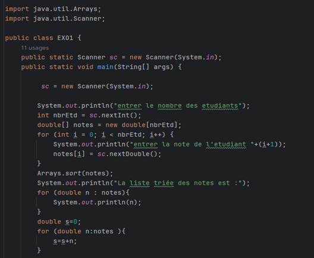
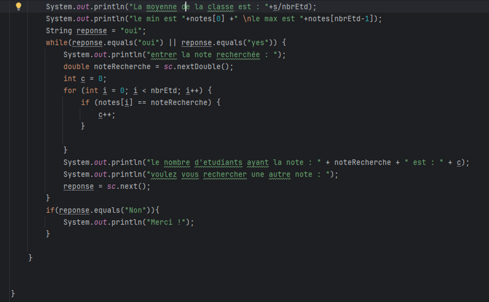
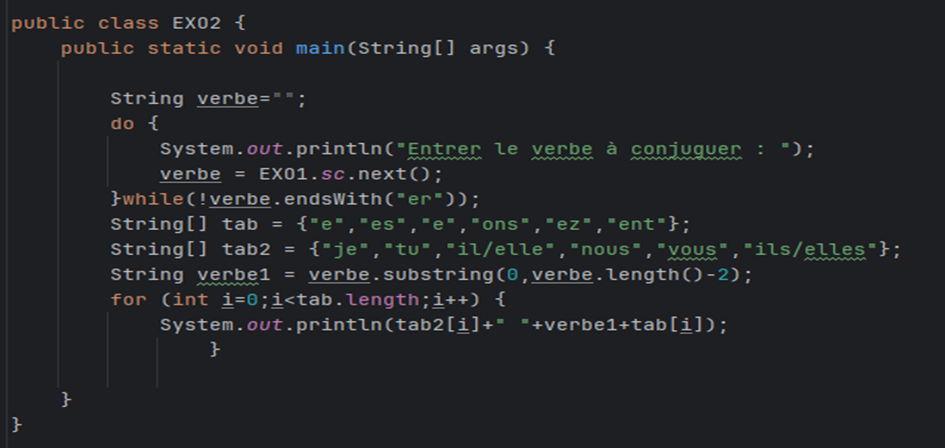
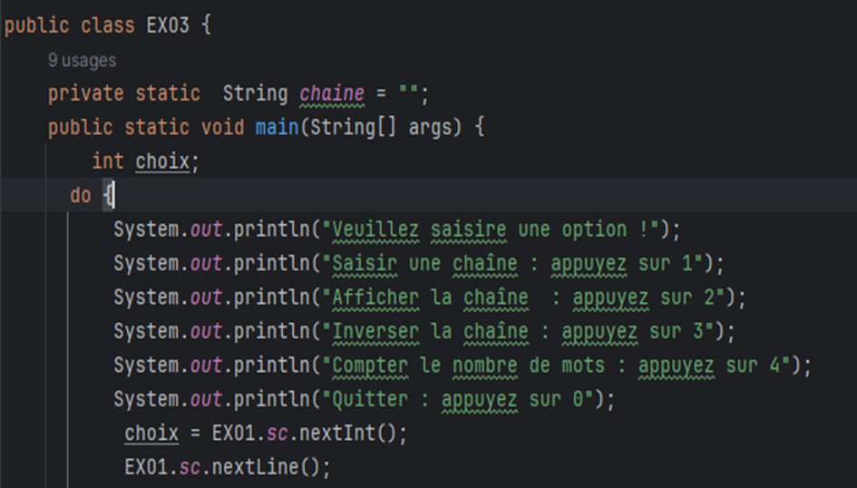
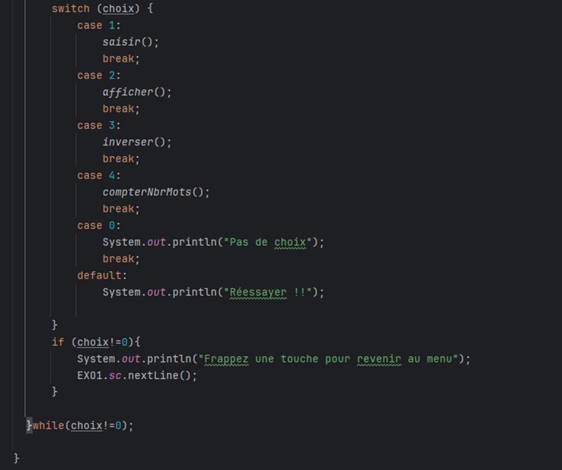
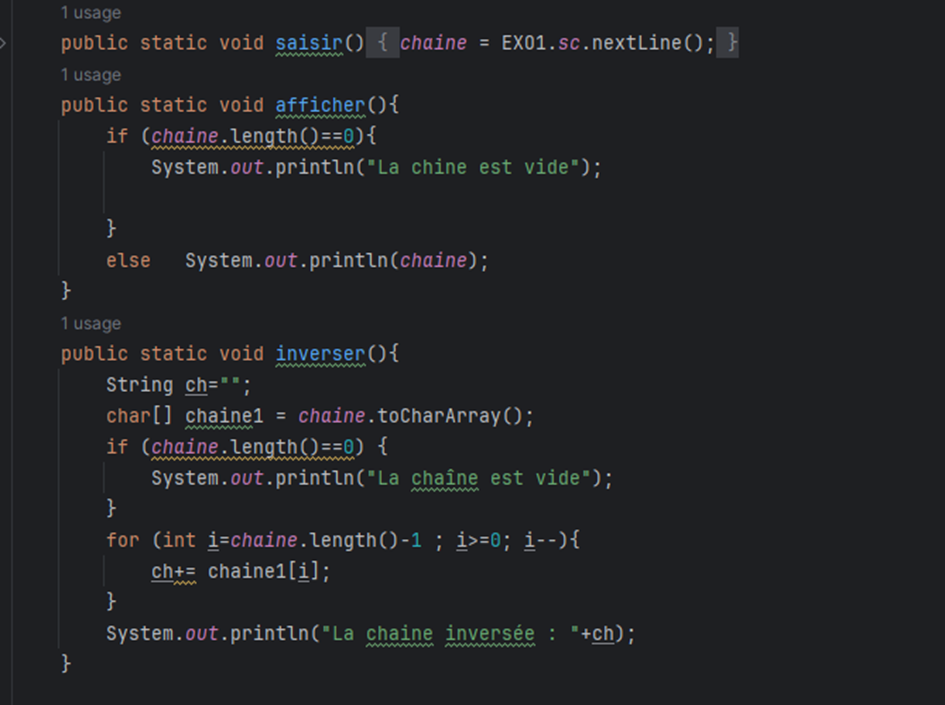
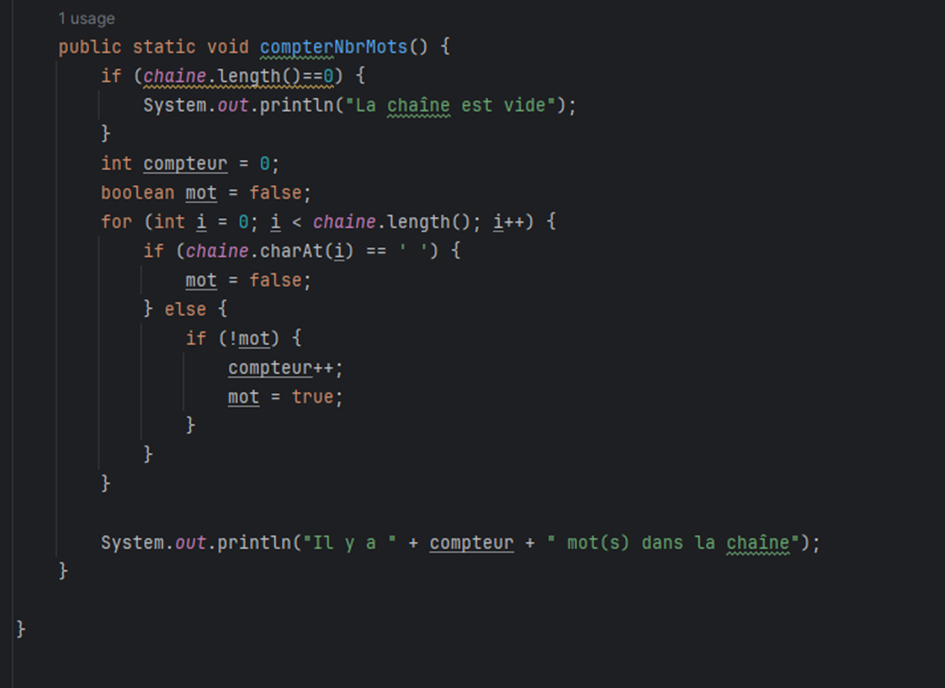
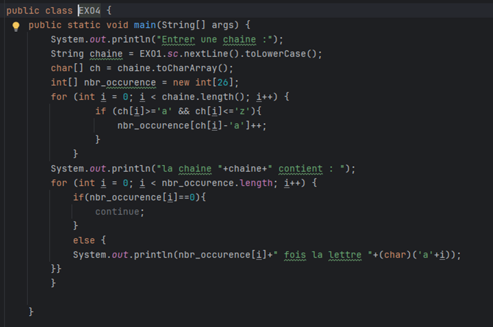

# Java Programming Lab 1: Strings & Arrays

## Overview
This lab focuses on implementing fundamental concepts of array manipulation and string handling in Java through four practical exercises.

## Project Structure
```
src/
├── EXO1.java    # Student Grade Management
├── EXO2.java    # First Group Verb Conjugation
├── EXO3.java    # String Manipulation
└── EXO4.java    # Letter Counter
```

## Exercise 1: Student Grade Management (EXO1.java)

### Features
- **Grade Sorting and Display**: Implementation using Arrays.sort() method
- **Average Calculation**: Computes and displays the average grade by summing all grades and dividing by the total number of entries
- **Maximum and Minimum Grade Determination**: After sorting, gets the last element for maximum and first element for minimum
- **Specific Grade Counter**: Counts the number of students who obtained a specific grade
- **Additional Feature**: Interactive grade search with the option to repeat the search by typing "yes" or "oui", implemented using a While loop



### Running EXO1
```bash
javac src/EXO1.java
java -cp src EXO1
```

## Exercise 2: First Group Verb Conjugation (EXO2.java)

### Features
- User input of a first group verb (-er verbs)
- Validation of verb ending ("-er")
- Extraction of verb stem
- Application of present tense endings for all persons



### Running EXO2
```bash
javac src/EXO2.java
java -cp src EXO2
```

## Exercise 3: String Manipulation (EXO3.java)

### Features
- Interactive menu system
- String input and validation
- String display
- String reversal
- Word count
- Menu-driven interface using Switch-case






### Menu Options
1. Enter a string
2. Display the string
3. Display reversed string
4. Count words
0. Exit

### Running EXO3
```bash
javac src/EXO3.java
java -cp src EXO3
```

## Exercise 4: Letter Counter (EXO4.java)

### Features
- String input with conversion to lowercase
- Character occurrence counting
- Display of letter frequencies (excluding non-present letters)
- Array-based counting implementation



### Running EXO4
```bash
javac src/EXO4.java
java -cp src EXO4
```

## Requirements
- Java Development Kit (JDK)
- Command line terminal or IDE of your choice

## How to Run the Project
1. Clone this repository
2. Navigate to the project directory
3. Compile and run any exercise using the commands provided above

For example, to run all exercises:
```bash
# Compile all files
javac src/*.java

# Run each exercise
java -cp src EXO1
java -cp src EXO2
java -cp src EXO3
java -cp src EXO4
```

## Note
Each exercise is contained in its own class file (EXO1 through EXO4) in the src directory and can be run independently. Follow the on-screen instructions when running each program.
